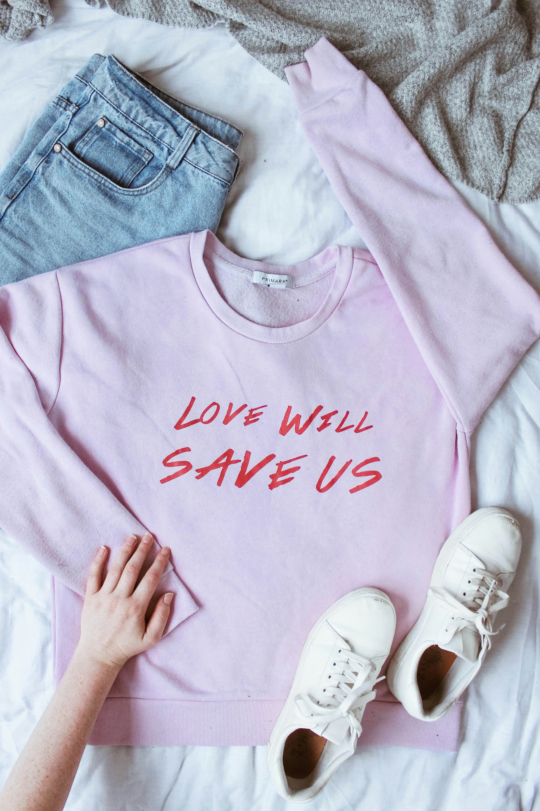
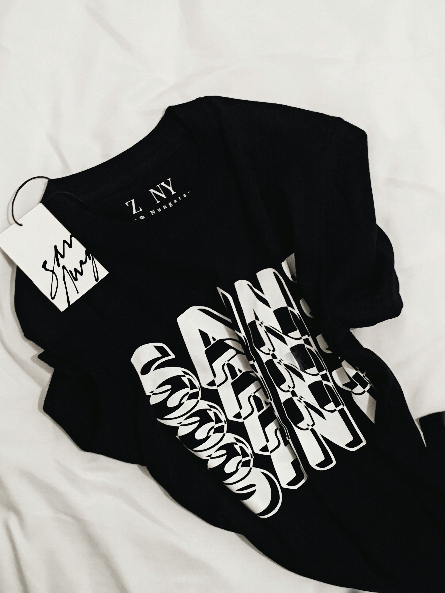

# Web-Integrador
Como proyecto se me ocurrio hacer una pagina para una tienda de ropa. En este caso usaria de ejemplo la tienda de ropa "Itulugar" que es un emprendimiento familiar.

# Author: Rodrigo Nicolas Mendez

# Diseño UX

### 1 - Objetivo principal de la pagina y publico objetivo
El objetivo principal de la pagina es tener todo el catalogo de la tienda bien distribuido y accesible para todo aquel que quiera comprar

### 2 - Ideas del Cliente y Contenido
    https://mendezrodrigotag.github.io/Web-Integrador/

1. Presentacion: Imagen de la empresa / logo / frase / nombre empresa / mision
2. seccion 2: detalle
3. seccion 3: detalle

### 3 - Presentacion de las ideas

1. Presentacion: Imagen principal - contenido hero - texto/nombre/slogan/mision - centrado en la imagen
2. seccion 2: Productos mas vendidos y sus respectivos precios  
3. seccion 3: Imagenes con productos de temporada / calzado con link directo a su respectiva pagina 

### 4 - Wireframe

    Pagina 1: Principal

    Pagina 2: Contacto 

## Diseño UI

### 1 - Fonts

    - Font: Tahoma

### 2 - Colores

    #FFECE4
    #FFF4E4
    #949DA5

### 3 - Imagenes

### 4 - Png
